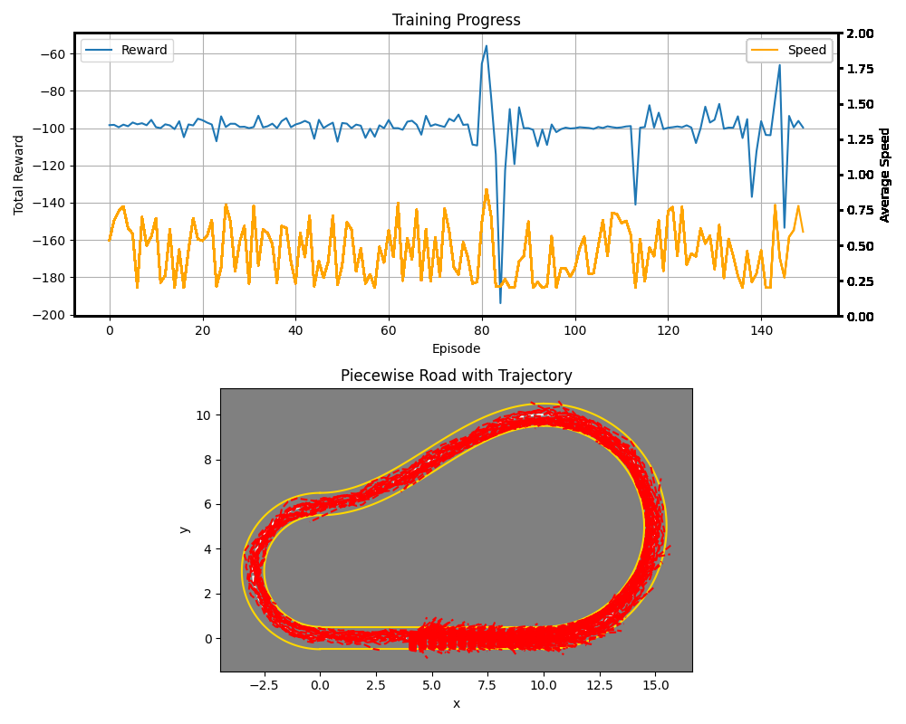

# Car on Elliptical Road Simulator

This Python environment simulates a car navigating a closed-loop road with elliptical sections. The car receives sensor readings and takes actions (steering and acceleration/deceleration) to stay on the road and potentially maximize rewards. Using Q-Learning, our car learns from the environment and learns when to steer, accelerate and brake. This is a work in progress, and we are continuously expanding it.

## Table of Contents
- [Overview](#overview)
- [Requirements](#requirements)
- [Setup](#setup)
- [Usage](#usage)
- [Code Explanation](#code-explanation)
  - [Policy Network](#policy-network)
  - [Road Environment](#road-environment)
  - [Car Environment](#car-environment)
  - [Visualization](#visualization)
  - [Main Training Script](#main-training-script)
- [Acknowledgments](#acknowledgments)

## Overview
This project demonstrates the implementation of a reinforcement learning model for navigating a car through a defined road environment using Deep Q-Learning. The project includes three main components: the policy network, the road environment, and the car environment. Additionally, there is a visualization component to visualize the car's trajectory and the road.



## Requirements
To run this project, you will need the following packages:
- torch
- numpy
- sympy
- scipy
- matplotlib

You can install the required packages using the following command:
```bash
pip install -r requirements.txt
```

## Setup

Setup

1. Clone the repository.
2. Navigate to the project directory.
3. Install the required packages using pip install -r requirements.txt.

## Usage

Run the main script to train the model:

```bash
python run.py
```

The script will initialize the environment and the policy network, then start the training process. Feel free to change the number of episodes in run.py. You can also choose to train the model from scratch or resume training.

## Code Explanation

### Policy Network
The PolicyNetwork class defines the neural network used to make decisions about which actions the car should take in the environment.


### Road Environment
The RoadEnv class defines the road environment including the shape of the course and the boundaries.

### Car Environment
The CarEnv class defines the car's interaction with the road environment, including its movement and state updates.

### Visualization
The visualization.py script provides functionality to visualize the car's trajectory and the road environment. This helps in understanding how the car navigates through the road segments over time.

### Main Training Script

The main training script initializes the settings, road environment, car environment, and policy network, and starts the training process. You can change the number of training episodes and choose whether to resume training by editing the following:

```bash
#Set resume to True if you want to resume training.
NN = PolicyNetwork(roadenv, carenv, settings, train_mode=True,resume=False)
#Edit the 150 below to as many episodes as you would like
NN.train(150)
```

## Acknowledgments

This project uses PyTorch for building and training the neural network, and other libraries for mathematical computations and optimizations.


